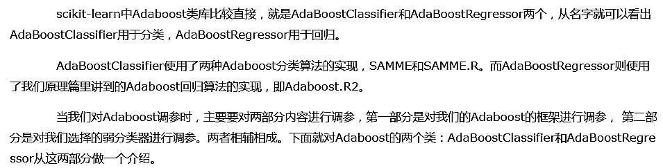
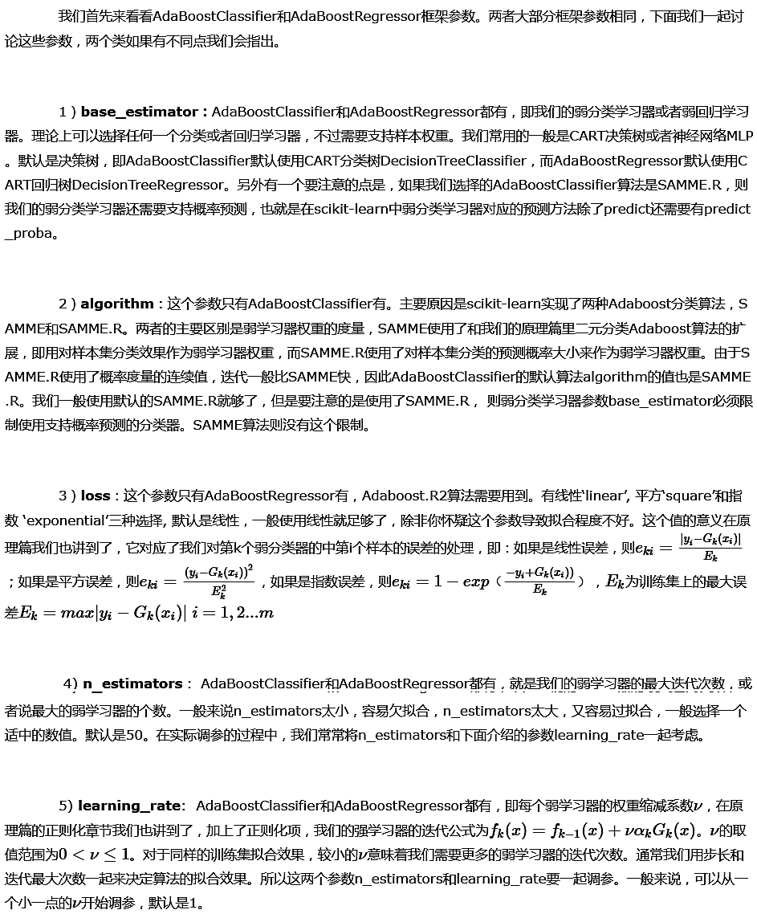
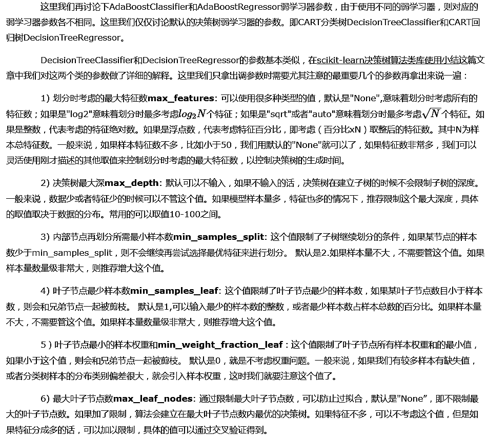
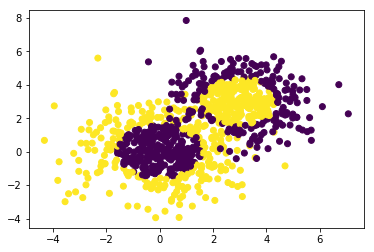
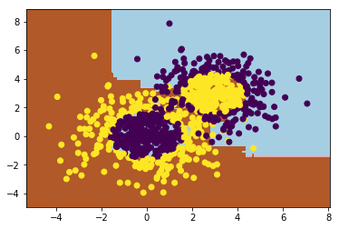

# 1. Adaboost类库概述



# 2. AdaBoostClassifier和AdaBoostRegressor框架参数



# 3. AdaBoostClassifier和AdaBoostRegressor弱学习器参数



# 4. AdaBoostClassifier实战


```python
# 导入相关类库
import numpy as np
import matplotlib.pyplot as plt
%matplotlib inline
from sklearn.ensemble import AdaBoostClassifier
from sklearn.tree import DecisionTreeClassifier
from sklearn.datasets import make_gaussian_quantiles
```


```python
# 生成2维正态分布，生成的数据按分位数分为两类，500个样本,2个样本特征，协方差系数为2
X1, y1 = make_gaussian_quantiles(cov=2.0, n_features=2, random_state=1, n_classes=2, n_samples=500)
# 生成2维正态分布，生成的数据按分位数分为两类，400个样本,2个样本特征均值都为3，协方差系数为1.5
X2, y2 = make_gaussian_quantiles(mean=(3, 3), cov=1.5, n_classes=2, n_features=2, n_samples=400, random_state=1)

# 将两组数据合成一组数据（默认为列方向）
X = np.concatenate((X1, X2))
y = np.concatenate((y1, - y2 + 1))
```


```python
# 可视化数据
plt.scatter(X[:, 0], X[:, 1], marker='o', c=y)
```


    <matplotlib.collections.PathCollection at 0x1bb88fe4d68>





```python
clf = AdaBoostClassifier(base_estimator=DecisionTreeClassifier(max_depth=2, min_samples_split=20, min_samples_leaf=5),
                         algorithm='SAMME', learning_rate=0.8, n_estimators=200)
clf.fit(X, y)
```


    AdaBoostClassifier(algorithm='SAMME',
              base_estimator=DecisionTreeClassifier(class_weight=None, criterion='gini', max_depth=2,
                max_features=None, max_leaf_nodes=None,
                min_impurity_split=1e-07, min_samples_leaf=5,
                min_samples_split=20, min_weight_fraction_leaf=0.0,
                presort=False, random_state=None, splitter='best'),
              learning_rate=0.8, n_estimators=200, random_state=None)


```python
x_min, x_max = X[:, 0].min() - 1, X[:, 0].max() + 1
y_min, y_max = X[:, 1].min() - 1, X[:, 1].max() + 1
xx, yy = np.meshgrid(np.arange(x_min, x_max, 0.02),
                    np.arange(y_min, y_max, 0.02))
z = clf.predict(np.concatenate((xx.ravel()[:, np.newaxis], yy.ravel()[:, np.newaxis]), axis=1))
# z = clf.predict(np.c_[xx.ravel(), yy.ravel()])
z = z.reshape(xx.shape)
plt.contourf(xx, yy, z, cmap=plt.cm.Paired)
plt.scatter(X[:, 0], X[:, 1], marker='o', c=y)
plt.show()
```





```python
# 拟合分数
print('Score:', clf.score(X, y))
```

    Score: 0.913333333333
    


```python
# 现在我们将最大弱分离器个数从200增加到300。再来看看拟合分数
clf = AdaBoostClassifier(base_estimator=DecisionTreeClassifier(max_depth=2, min_samples_split=20, min_samples_leaf=5),
                         algorithm='SAMME', learning_rate=0.8, n_estimators=300)
clf.fit(X, y)
print('Score:', clf.score(X, y))
```

    Score: 0.962222222222
    


```python
# 这印证了我们前面讲的，弱分离器个数越多，则拟合程度越好，当然也越容易过拟合。
```


```python
# 现在我们降低步长，将步长从上面的0.8减少到0.5，再来看看拟合分数
clf = AdaBoostClassifier(base_estimator=DecisionTreeClassifier(max_depth=2, min_samples_split=20, min_samples_leaf=5),
                         algorithm='SAMME', learning_rate=0.5, n_estimators=300)
clf.fit(X, y)
print('Score:', clf.score(X, y))
```

    Score: 0.894444444444
    


```python
# 可见在同样的弱分类器的个数情况下，如果减少步长，拟合效果会下降
```


```python
# 最后我们看看当弱分类器个数为700，步长为0.7时候的情况
clf = AdaBoostClassifier(base_estimator=DecisionTreeClassifier(max_depth=2, min_samples_split=20, min_samples_leaf=5),
                         algorithm='SAMME', learning_rate=0.7, n_estimators=700)
clf.fit(X, y)
print('Score:', clf.score(X, y))
```

    Score: 0.968888888889
    


```python
# 此时的拟合分数和我们最初的300弱分类器，0.8步长的拟合程度相当。
# 也就是说，在我们这个例子中，如果步长从0.8降到0.7，则弱分类器个数要从300增加到700才能达到类似的拟合效果。
```
