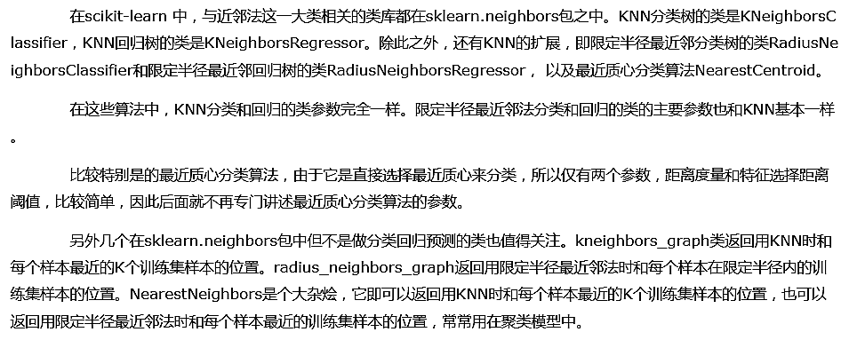
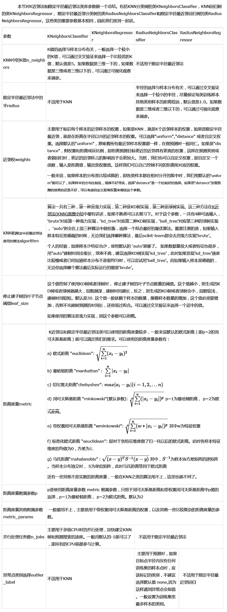
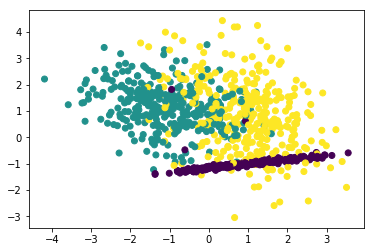
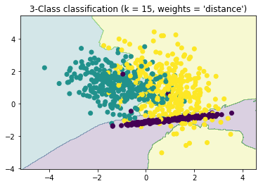

# 1. scikit-learn 中KNN相关的类库概述



# 2. K近邻法和限定半径最近邻法类库参数小结



# 3. 使用KNeighborsClassifier做分类的实例

## 3.1 生成随机数据


```python
import numpy as np
import matplotlib.pyplot as plt
%matplotlib inline
from sklearn.datasets.samples_generator import make_classification
```


```python
# X为样本特征，Y为样本类别输出， 共1000个样本，每个样本2个特征，输出有3个类别，没有冗余特征，每个类别一个簇
X, Y = make_classification(n_samples = 1000, n_features = 2, n_redundant = 0, 
                           n_clusters_per_class = 1, n_classes = 3)
plt.scatter(X[:, 0], X[:, 1], marker = 'o', c = Y)
plt.show()
```





## 3.2 拟合模型


```python
from sklearn.neighbors import KNeighborsClassifier
clf = KNeighborsClassifier(n_neighbors = 15, weights = 'distance')
clf.fit(X, Y)
```


    KNeighborsClassifier(algorithm='auto', leaf_size=30, metric='minkowski',
               metric_params=None, n_jobs=1, n_neighbors=15, p=2,
               weights='distance')


```python
# 确定训练集的边界
x_min, x_max = X[:, 0].min() - 1, X[:, 0].max() + 1
y_min, y_max = X[:, 1].min() - 1, X[:, 1].max() + 1

xx, yy = np.meshgrid(np.arange(x_min, x_max, 0.02), np.arange(y_min, y_max, 0.02))
Z = clf.predict(np.c_[xx.ravel(), yy.ravel()])
Z = Z.reshape(xx.shape)

plt.contourf(xx, yy, Z, alpha = 0.2)
plt.scatter(X[:, 0], X[:, 1], c = Y)
plt.title("3-Class classification (k = 15, weights = 'distance')" )
plt.show()
```




