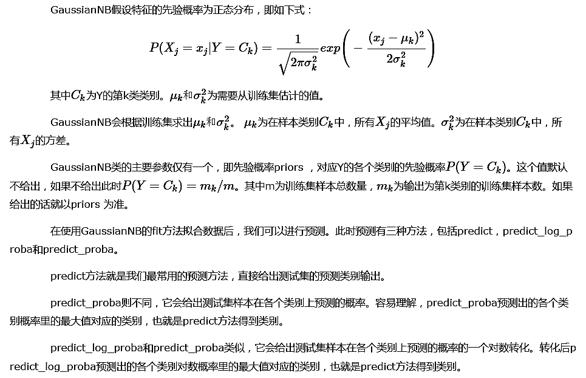
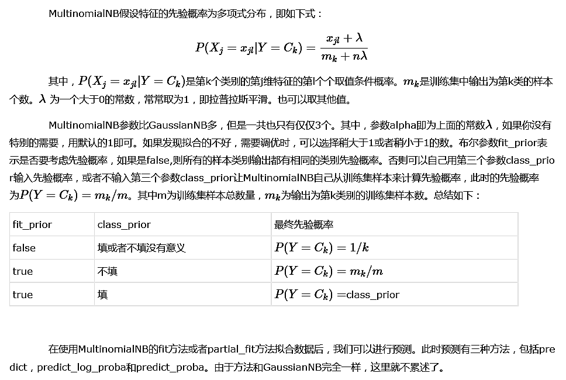
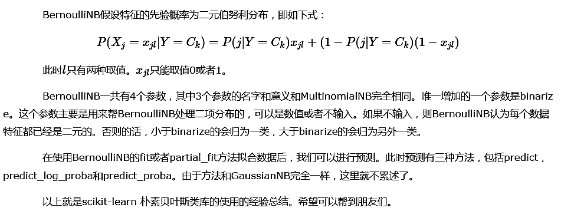

# 1. scikit-learn 朴素贝叶斯类库概述


# 2. GaussianNB类使用总结




```python
import numpy as np
X = np.array([[-1, -1], [-2, -1], [-3, -2], [1, 1], [2, 1], [3, 2]])
Y = np.array([1, 1, 1, 2, 2, 2])
from sklearn.naive_bayes import GaussianNB
clf = GaussianNB()
#拟合数据
clf.fit(X, Y)
print("==Predict result by predict==")
print(clf.predict([[-0.8, -1]]))
print("==Predict result by predict_proba==")
print(clf.predict_proba([[-0.8, -1]]))
print("==Predict result by predict_log_proba==")
print(clf.predict_log_proba([[-0.8, -1]]))
```

    ==Predict result by predict==
    [1]
    ==Predict result by predict_proba==
    [[  9.99999949e-01   5.05653254e-08]]
    ==Predict result by predict_log_proba==
    [[ -5.05653266e-08  -1.67999998e+01]]
    


```python
# GaussianNB一个重要的功能是有 partial_fit方法，这个方法的一般用在如果训练集数据量非常大，一次不能全部载入内存的时候。
# 这时我们可以把训练集分成若干等分，重复调用partial_fit来一步步的学习训练集，非常方便。
# 后面讲到的MultinomialNB和BernoulliNB也有类似的功能。
```

# 3. MultinomialNB类使用总结



# 4. BernoulliNB类使用总结


