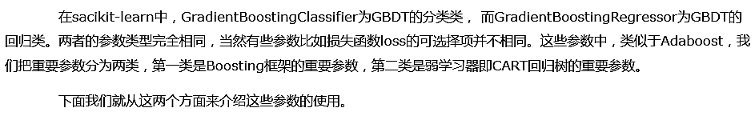
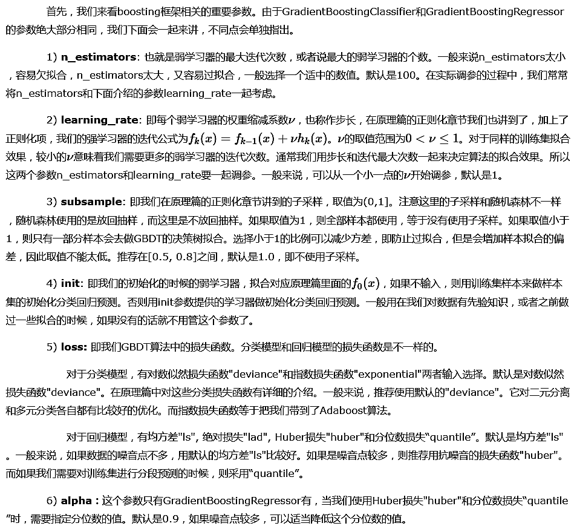
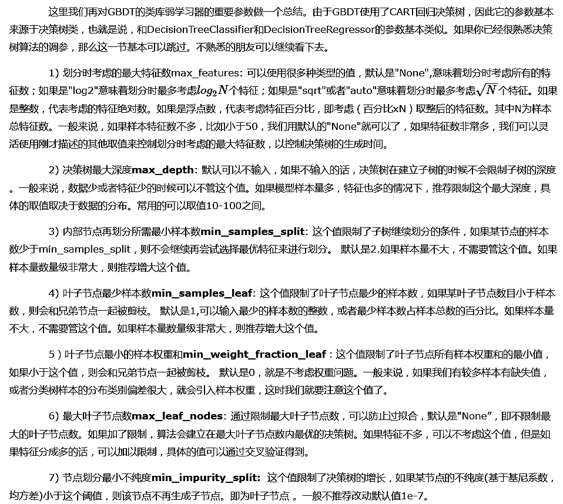

# 1. scikit-learn GBDT类库概述



# 2. GBDT类库boosting框架参数



# 3. GBDT类库弱学习器参数



# 4. GBDT调参实例


```python
# 导入相关类库
import numpy as np
import pandas as pd
from sklearn import cross_validation, metrics
from sklearn.ensemble import GradientBoostingClassifier
from sklearn.grid_search import GridSearchCV
import matplotlib.pyplot as plt
%matplotlib inline
```


```python
# 读取数据
train = pd.read_csv('train_modified.csv')
# Disbursed的值就是二元分类的输出
target='Disbursed'
IDcol = 'ID'
train['Disbursed'].value_counts() 
# print(train.columns)
```


    0    19680
    1      320
    Name: Disbursed, dtype: int64


```python
# 现在我们得到我们的训练集。最后一列Disbursed是分类输出。前面的所有列（不考虑ID列）都是样本特征
x_columns = [x for x in train.columns if x not in [target, IDcol]]
X = train[x_columns]
y = train['Disbursed']
```


```python
gbm0 = GradientBoostingClassifier(random_state=10)
gbm0.fit(X,y)
y_pred = gbm0.predict(X)
y_predprob = gbm0.predict_proba(X)[:,1]
print("Accuracy : %.4g" % metrics.accuracy_score(y.values, y_pred))
print("AUC Score (Train): %f" % metrics.roc_auc_score(y, y_predprob))
```

    Accuracy : 0.9852
    AUC Score (Train): 0.900531
    


```python
# 我们下面看看怎么通过调参提高模型的泛化能力
```


```python
# 首先我们从步长(learning rate)和迭代次数(n_estimators)入手。一般来说,开始选择一个较小的步长来网格搜索最好的迭代次数。
# 这里，我们将步长初始值设置为0.1
param_test1 = {'n_estimators':[i for i in range(20, 81, 10)]}
gsearch1 = GridSearchCV(estimator = GradientBoostingClassifier(learning_rate=0.1, min_samples_split=300,
                                  min_samples_leaf=20,max_depth=8, max_features='sqrt', subsample=0.8, random_state=10), 
                       param_grid = param_test1, scoring='roc_auc',iid=False,cv=5)
gsearch1.fit(X,y)
gsearch1.grid_scores_, gsearch1.best_params_, gsearch1.best_score_
```


    ([mean: 0.81285, std: 0.01967, params: {'n_estimators': 20},
      mean: 0.81438, std: 0.01947, params: {'n_estimators': 30},
      mean: 0.81451, std: 0.01933, params: {'n_estimators': 40},
      mean: 0.81618, std: 0.01848, params: {'n_estimators': 50},
      mean: 0.81779, std: 0.01736, params: {'n_estimators': 60},
      mean: 0.81533, std: 0.01900, params: {'n_estimators': 70},
      mean: 0.81322, std: 0.01860, params: {'n_estimators': 80}],
     {'n_estimators': 60},
     0.8177893165650406)


```python
# 找到了一个合适的迭代次数，现在我们开始对决策树进行调参。
# 首先我们对决策树最大深度max_depth和内部节点再划分所需最小样本数min_samples_split进行网格搜索。
param_test2 = {'max_depth':[i for i in range(3,14,2)], 'min_samples_split':[i for i in range(100,801,200)]}
gsearch2 = GridSearchCV(estimator = GradientBoostingClassifier(learning_rate=0.1, n_estimators=60, min_samples_leaf=20, 
      max_features='sqrt', subsample=0.8, random_state=10), 
   param_grid = param_test2, scoring='roc_auc',iid=False, cv=5)
gsearch2.fit(X,y)
gsearch2.grid_scores_, gsearch2.best_params_, gsearch2.best_score_
```


    ([mean: 0.81199, std: 0.02073, params: {'max_depth': 3, 'min_samples_split': 100},
      mean: 0.81267, std: 0.01985, params: {'max_depth': 3, 'min_samples_split': 300},
      mean: 0.81238, std: 0.01937, params: {'max_depth': 3, 'min_samples_split': 500},
      mean: 0.80925, std: 0.02051, params: {'max_depth': 3, 'min_samples_split': 700},
      mean: 0.81846, std: 0.01843, params: {'max_depth': 5, 'min_samples_split': 100},
      mean: 0.81630, std: 0.01810, params: {'max_depth': 5, 'min_samples_split': 300},
      mean: 0.81315, std: 0.01898, params: {'max_depth': 5, 'min_samples_split': 500},
      mean: 0.81262, std: 0.02090, params: {'max_depth': 5, 'min_samples_split': 700},
      mean: 0.81807, std: 0.02004, params: {'max_depth': 7, 'min_samples_split': 100},
      mean: 0.82137, std: 0.01733, params: {'max_depth': 7, 'min_samples_split': 300},
      mean: 0.81703, std: 0.01773, params: {'max_depth': 7, 'min_samples_split': 500},
      mean: 0.81383, std: 0.02327, params: {'max_depth': 7, 'min_samples_split': 700},
      mean: 0.81107, std: 0.02178, params: {'max_depth': 9, 'min_samples_split': 100},
      mean: 0.80944, std: 0.02612, params: {'max_depth': 9, 'min_samples_split': 300},
      mean: 0.81476, std: 0.01973, params: {'max_depth': 9, 'min_samples_split': 500},
      mean: 0.81601, std: 0.02576, params: {'max_depth': 9, 'min_samples_split': 700},
      mean: 0.81101, std: 0.02222, params: {'max_depth': 11, 'min_samples_split': 100},
      mean: 0.81309, std: 0.02696, params: {'max_depth': 11, 'min_samples_split': 300},
      mean: 0.81713, std: 0.02379, params: {'max_depth': 11, 'min_samples_split': 500},
      mean: 0.81347, std: 0.02702, params: {'max_depth': 11, 'min_samples_split': 700},
      mean: 0.81484, std: 0.01776, params: {'max_depth': 13, 'min_samples_split': 100},
      mean: 0.80825, std: 0.02291, params: {'max_depth': 13, 'min_samples_split': 300},
      mean: 0.81923, std: 0.01693, params: {'max_depth': 13, 'min_samples_split': 500},
      mean: 0.81382, std: 0.02258, params: {'max_depth': 13, 'min_samples_split': 700}],
     {'max_depth': 7, 'min_samples_split': 300},
     0.8213724275914632)


```python
# 由于决策树深度7是一个比较合理的值，我们把它定下来，对于内部节点再划分所需最小样本数min_samples_split，我们暂时不能一起定下来
# 因为这个还和决策树其他的参数存在关联
# 下面我们再对内部节点再划分所需最小样本数min_samples_split和叶子节点最少样本数min_samples_leaf一起调参
param_test3 = {'min_samples_split':[i for i in range(800,1900,200)], 'min_samples_leaf':[i for i in range(60,101,10)]}
gsearch3 = GridSearchCV(estimator = GradientBoostingClassifier(learning_rate=0.1, n_estimators=60, max_depth=7,
                                     max_features='sqrt', subsample=0.8, random_state=10), 
                       param_grid = param_test3, scoring='roc_auc',iid=False, cv=5)
gsearch3.fit(X,y)
gsearch3.grid_scores_, gsearch3.best_params_, gsearch3.best_score_
```


    ([mean: 0.81828, std: 0.02251, params: {'min_samples_leaf': 60, 'min_samples_split': 800},
      mean: 0.81731, std: 0.02344, params: {'min_samples_leaf': 60, 'min_samples_split': 1000},
      mean: 0.82220, std: 0.02250, params: {'min_samples_leaf': 60, 'min_samples_split': 1200},
      mean: 0.81447, std: 0.02125, params: {'min_samples_leaf': 60, 'min_samples_split': 1400},
      mean: 0.81495, std: 0.01626, params: {'min_samples_leaf': 60, 'min_samples_split': 1600},
      mean: 0.81528, std: 0.02140, params: {'min_samples_leaf': 60, 'min_samples_split': 1800},
      mean: 0.81590, std: 0.02517, params: {'min_samples_leaf': 70, 'min_samples_split': 800},
      mean: 0.81573, std: 0.02207, params: {'min_samples_leaf': 70, 'min_samples_split': 1000},
      mean: 0.82021, std: 0.02521, params: {'min_samples_leaf': 70, 'min_samples_split': 1200},
      mean: 0.81512, std: 0.01995, params: {'min_samples_leaf': 70, 'min_samples_split': 1400},
      mean: 0.81395, std: 0.02081, params: {'min_samples_leaf': 70, 'min_samples_split': 1600},
      mean: 0.81587, std: 0.02082, params: {'min_samples_leaf': 70, 'min_samples_split': 1800},
      mean: 0.82064, std: 0.02698, params: {'min_samples_leaf': 80, 'min_samples_split': 800},
      mean: 0.81490, std: 0.02475, params: {'min_samples_leaf': 80, 'min_samples_split': 1000},
      mean: 0.82009, std: 0.02568, params: {'min_samples_leaf': 80, 'min_samples_split': 1200},
      mean: 0.81850, std: 0.02226, params: {'min_samples_leaf': 80, 'min_samples_split': 1400},
      mean: 0.81855, std: 0.02099, params: {'min_samples_leaf': 80, 'min_samples_split': 1600},
      mean: 0.81666, std: 0.02249, params: {'min_samples_leaf': 80, 'min_samples_split': 1800},
      mean: 0.81960, std: 0.02437, params: {'min_samples_leaf': 90, 'min_samples_split': 800},
      mean: 0.81560, std: 0.02235, params: {'min_samples_leaf': 90, 'min_samples_split': 1000},
      mean: 0.81936, std: 0.02542, params: {'min_samples_leaf': 90, 'min_samples_split': 1200},
      mean: 0.81362, std: 0.02254, params: {'min_samples_leaf': 90, 'min_samples_split': 1400},
      mean: 0.81429, std: 0.02417, params: {'min_samples_leaf': 90, 'min_samples_split': 1600},
      mean: 0.81299, std: 0.02262, params: {'min_samples_leaf': 90, 'min_samples_split': 1800},
      mean: 0.82000, std: 0.02511, params: {'min_samples_leaf': 100, 'min_samples_split': 800},
      mean: 0.82209, std: 0.01816, params: {'min_samples_leaf': 100, 'min_samples_split': 1000},
      mean: 0.81821, std: 0.02337, params: {'min_samples_leaf': 100, 'min_samples_split': 1200},
      mean: 0.81922, std: 0.02377, params: {'min_samples_leaf': 100, 'min_samples_split': 1400},
      mean: 0.81545, std: 0.02221, params: {'min_samples_leaf': 100, 'min_samples_split': 1600},
      mean: 0.81704, std: 0.02509, params: {'min_samples_leaf': 100, 'min_samples_split': 1800}],
     {'min_samples_leaf': 60, 'min_samples_split': 1200},
     0.8222032996697154)


```python
# 我们调了这么多参数了，终于可以都放到GBDT类里面去看看效果了。现在我们用新参数拟合数据
gbm1 = GradientBoostingClassifier(learning_rate=0.1, n_estimators=60,max_depth=7, min_samples_leaf =60, 
               min_samples_split =1200, max_features='sqrt', subsample=0.8, random_state=10)
gbm1.fit(X,y)
y_pred = gbm1.predict(X)
y_predprob = gbm1.predict_proba(X)[:,1]
print("Accuracy : %.4g" % metrics.accuracy_score(y.values, y_pred))
print("AUC Score (Train): %f" % metrics.roc_auc_score(y, y_predprob))
```

    Accuracy : 0.984
    AUC Score (Train): 0.908099
    


```python
# 对比我们最开始完全不调参的拟合效果，可见精确度稍有下降，主要原理是我们使用了0.8的子采样，20%的数据没有参与拟合。
# 现在我们再对最大特征数max_features进行网格搜索。
param_test4 = {'max_features':[i for i in range(7,20,2)]}
gsearch4 = GridSearchCV(estimator = GradientBoostingClassifier(learning_rate=0.1, n_estimators=60, max_depth=7, min_samples_leaf =60, 
               min_samples_split =1200, subsample=0.8, random_state=10), 
                       param_grid = param_test4, scoring='roc_auc',iid=False, cv=5)
gsearch4.fit(X,y)
gsearch4.grid_scores_, gsearch4.best_params_, gsearch4.best_score_
```


    ([mean: 0.82220, std: 0.02250, params: {'max_features': 7},
      mean: 0.82241, std: 0.02421, params: {'max_features': 9},
      mean: 0.82108, std: 0.02302, params: {'max_features': 11},
      mean: 0.82064, std: 0.01900, params: {'max_features': 13},
      mean: 0.82198, std: 0.01514, params: {'max_features': 15},
      mean: 0.81355, std: 0.02053, params: {'max_features': 17},
      mean: 0.81877, std: 0.01863, params: {'max_features': 19}],
     {'max_features': 9},
     0.822412506351626)


```python
# 现在我们再对子采样的比例进行网格搜索
param_test5 = {'subsample':[0.6,0.7,0.75,0.8,0.85,0.9]}
gsearch5 = GridSearchCV(estimator = GradientBoostingClassifier(learning_rate=0.1, n_estimators=60, max_depth=7, min_samples_leaf =60, 
               min_samples_split =1200, max_features=9, random_state=10), 
                       param_grid = param_test5, scoring='roc_auc',iid=False, cv=5)
gsearch5.fit(X,y)
gsearch5.grid_scores_, gsearch5.best_params_, gsearch5.best_score_
```


    ([mean: 0.81828, std: 0.02392, params: {'subsample': 0.6},
      mean: 0.82344, std: 0.02708, params: {'subsample': 0.7},
      mean: 0.81673, std: 0.02196, params: {'subsample': 0.75},
      mean: 0.82241, std: 0.02421, params: {'subsample': 0.8},
      mean: 0.82285, std: 0.02446, params: {'subsample': 0.85},
      mean: 0.81738, std: 0.02236, params: {'subsample': 0.9}],
     {'subsample': 0.7},
     0.8234378969766262)


```python
# 现在我们基本已经得到我们所有调优的参数结果了。这时我们可以减半步长，最大迭代次数加倍来增加我们模型的泛化能力。再次拟合我们的模型
gbm2 = GradientBoostingClassifier(learning_rate=0.05, n_estimators=120, max_depth=7, min_samples_leaf =60, 
               min_samples_split =1200, max_features=9, subsample=0.7, random_state=10)
gbm2.fit(X,y)
y_pred = gbm2.predict(X)
y_predprob = gbm2.predict_proba(X)[:,1]
print("Accuracy : %.4g" % metrics.accuracy_score(y.values, y_pred))
print("AUC Score (Train): %f" % metrics.roc_auc_score(y, y_predprob))
```

    Accuracy : 0.984
    AUC Score (Train): 0.905324
    


```python
# 可以看到AUC分数比起之前的版本稍有下降，这个原因是我们为了增加模型泛化能力
# 为防止过拟合而减半步长，最大迭代次数加倍，同时减小了子采样的比例，从而减少了训练集的拟合程度。
```


```python
# 下面我们继续将步长缩小5倍，最大迭代次数增加5倍，继续拟合我们的模型
gbm3 = GradientBoostingClassifier(learning_rate=0.01, n_estimators=600, max_depth=7, min_samples_leaf =60, 
               min_samples_split =1200, max_features=9, subsample=0.7, random_state=10)
gbm3.fit(X,y)
y_pred = gbm3.predict(X)
y_predprob = gbm3.predict_proba(X)[:,1]
print("Accuracy : %.4g" % metrics.accuracy_score(y.values, y_pred))
print("AUC Score (Train): %f" % metrics.roc_auc_score(y, y_predprob))
```

    Accuracy : 0.984
    AUC Score (Train): 0.908581
    


```python
# 可见减小步长增加迭代次数可以在保证泛化能力的基础上增加一些拟合程度
```


```python
# 最后我们继续步长缩小一半，最大迭代次数增加2倍，拟合我们的模型
gbm4 = GradientBoostingClassifier(learning_rate=0.005, n_estimators=1200, max_depth=7, min_samples_leaf =60, 
               min_samples_split =1200, max_features=9, subsample=0.7, random_state=10)
gbm4.fit(X,y)
y_pred = gbm4.predict(X)
y_predprob = gbm4.predict_proba(X)[:,1]
print("Accuracy : %.4g" % metrics.accuracy_score(y.values, y_pred))
print("AUC Score (Train): %f" % metrics.roc_auc_score(y, y_predprob))
```

    Accuracy : 0.984
    AUC Score (Train): 0.908232
    


```python
# 此时由于步长实在太小，导致拟合效果反而变差，也就是说，步长不能设置的过小
```
