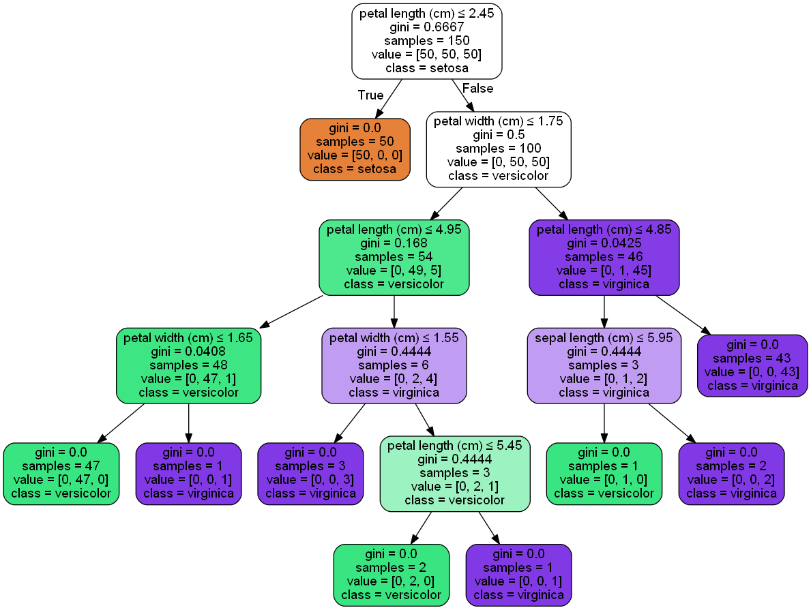

# 1. scikit-learn决策树算法类库介绍


# 2. DecisionTreeClassifier和DecisionTreeClassifier 重要参数调参注意点


# 3. scikit-learn决策树结果的可视化


## 3.1 决策树可视化环境搭建


## 3.2 决策树可视化的三种方法


```python
# 首先载入类库
from sklearn.datasets import load_iris
from sklearn import tree
import sys
import os       
os.environ["PATH"] += os.pathsep + 'F:/Graphviz2.38/bin'
```


```python
# 载入sciki-learn的自带数据(3个类别的分类数据)，由决策树拟合，得到模型
iris = load_iris()
clf = tree.DecisionTreeClassifier()
clf = clf.fit(iris.data, iris.target)
```


```python
# 现在可以将模型存入dot文件iris.dot
with open("iris.dot", 'w') as f:
    f = tree.export_graphviz(clf, out_file = f, 
                         feature_names = iris.feature_names,  
                         class_names = iris.target_names,  
                         filled = True, rounded = True,  
                         special_characters = True)
```


```python
# 第一种是用graphviz的dot命令生成决策树的可视化文件
# 注意，这个命令在命令行执行
# dot -Tpdf iris.dot -o iris.pdf
```


```python
# 第二种方法是用pydotplus生成iris.pdf
import pydotplus 
# If None, the result is returned as a string
dot_data = tree.export_graphviz(clf, out_file = None, 
                         feature_names = iris.feature_names,  
                         class_names = iris.target_names,  
                         filled = True, rounded = True,  
                         special_characters = True) 
graph = pydotplus.graph_from_dot_data(dot_data) 
graph.write_pdf("iris.pdf")
```


    True


```python
# 第三种办法是个人比较推荐的做法，因为这样可以直接把图产生在ipython的notebook
from IPython.display import Image  
dot_data = tree.export_graphviz(clf, out_file = None, 
                         feature_names = iris.feature_names,  
                         class_names = iris.target_names,  
                         filled = True, rounded = True,  
                         special_characters = True)  
graph = pydotplus.graph_from_dot_data(dot_data)  
Image(graph.create_png())
```





# 4. DecisionTreeClassifier实例


```python
# product(A, B) returns the same as ((x,y) for x in A for y in B)
from itertools import product

import numpy as np
import matplotlib.pyplot as plt

from sklearn import datasets
from sklearn.tree import DecisionTreeClassifier
```


```python
# 仍然使用自带的iris数据
iris = datasets.load_iris()
X = iris.data[:, 0 : 2]
y = iris.target
```


```python
# 训练模型，限制树的最大深度4
clf = DecisionTreeClassifier(max_depth = 4)
# 拟合模型
clf.fit(X, y)
```


    DecisionTreeClassifier(class_weight=None, criterion='gini', max_depth=4,
                max_features=None, max_leaf_nodes=None,
                min_impurity_split=1e-07, min_samples_leaf=1,
                min_samples_split=2, min_weight_fraction_leaf=0.0,
                presort=False, random_state=None, splitter='best')


```python
# 画图
x_min, x_max = X[:, 0].min() - 1, X[:, 0].max() + 1
y_min, y_max = X[:, 1].min() - 1, X[:, 1].max() + 1
# 构造网格数组
xx, yy = np.meshgrid(np.arange(x_min, x_max, 0.1), np.arange(y_min, y_max, 0.1))

# ravel()函数将数组进行展开(沿着X轴方向) np.c_[[1,2],[3,4]] array([[1, 3], [2, 4]])
Z = clf.predict(np.c_[xx.ravel(), yy.ravel()])
# 每个对应位置xx,yy的对应预测值，不用上述方法的话，求Z只能用2层for循环了
Z = Z.reshape(xx.shape)

# 求等高线
plt.contourf(xx, yy, Z, alpha = 0.4)
plt.scatter(X[:, 0], X[:, 1], c = y, alpha = 0.8)
plt.show()
```


```python
from IPython.display import Image
from sklearn import tree
import pydotplus
```


```python
dot_data = tree.export_graphviz(clf, out_file = None, 
                         feature_names = iris.feature_names,  
                         class_names = iris.target_names,  
                         filled = True, rounded = True,  
                         special_characters = True)
graph = pydotplus.graph_from_dot_data(dot_data)
Image(graph.create_png())
```


