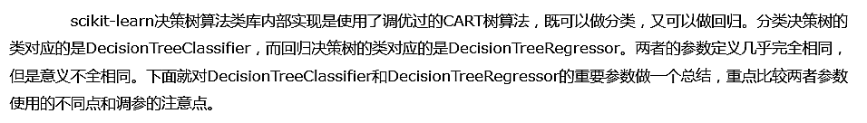

# 1. scikit-learn决策树算法类库介绍



# 2. DecisionTreeClassifier和DecisionTreeClassifier 重要参数调参注意点


# 3. scikit-learn决策树结果的可视化


## 3.1 决策树可视化环境搭建


## 3.2 决策树可视化的三种方法


```python
# 首先载入类库
from sklearn.datasets import load_iris
from sklearn import tree
import sys
import os       
os.environ["PATH"] += os.pathsep + 'F:/Graphviz2.38/bin'
```


```python
# 载入sciki-learn的自带数据(3个类别的分类数据)，由决策树拟合，得到模型
iris = load_iris()
clf = tree.DecisionTreeClassifier()
clf = clf.fit(iris.data, iris.target)
```


```python
# 现在可以将模型存入dot文件iris.dot
with open("iris.dot", 'w') as f:
    f = tree.export_graphviz(clf, out_file = f, 
                         feature_names = iris.feature_names,  
                         class_names = iris.target_names,  
                         filled = True, rounded = True,  
                         special_characters = True)
```


```python
# 第一种是用graphviz的dot命令生成决策树的可视化文件
# 注意，这个命令在命令行执行
# dot -Tpdf iris.dot -o iris.pdf
```


```python
# 第二种方法是用pydotplus生成iris.pdf
import pydotplus 
# If None, the result is returned as a string
dot_data = tree.export_graphviz(clf, out_file = None, 
                         feature_names = iris.feature_names,  
                         class_names = iris.target_names,  
                         filled = True, rounded = True,  
                         special_characters = True) 
graph = pydotplus.graph_from_dot_data(dot_data) 
graph.write_pdf("iris.pdf")
```


    True


```python
# 第三种办法是个人比较推荐的做法，因为这样可以直接把图产生在ipython的notebook
from IPython.display import Image  
dot_data = tree.export_graphviz(clf, out_file = None, 
                         feature_names = iris.feature_names,  
                         class_names = iris.target_names,  
                         filled = True, rounded = True,  
                         special_characters = True)  
graph = pydotplus.graph_from_dot_data(dot_data)  
Image(graph.create_png())
```


