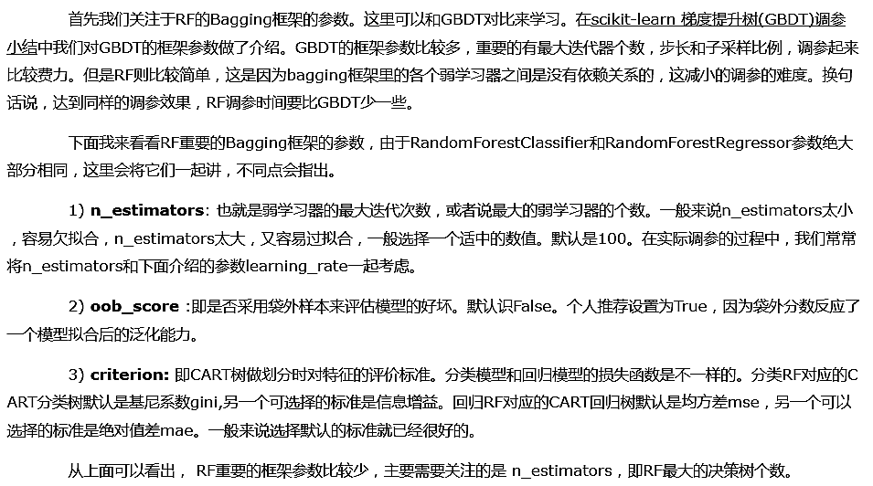
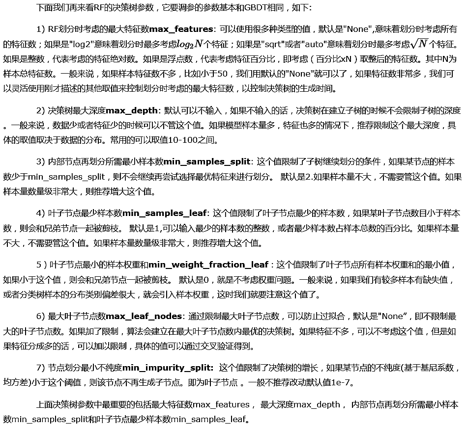

# 1. scikit-learn随机森林类库概述


# 2.  RF框架参数



# 3.  RF决策树参数



# 4.RF调参实例


```python
# 首先，我们载入需要的类库
import numpy as np
import pandas as pd
from sklearn.ensemble import RandomForestClassifier
from sklearn.grid_search import GridSearchCV
from sklearn import cross_validation, metrics
import matplotlib.pyplot as plt
%matplotlib inline
```


```python
# 接着，我们把解压的数据用下面的代码载入，顺便看看数据的类别分布
train = pd.read_csv('train_modified.csv')
# Disbursed的值就是二元分类的输出
target='Disbursed' 
IDcol = 'ID'
train['Disbursed'].value_counts() 
```


    0    19680
    1      320
    Name: Disbursed, dtype: int64


```python
# 接着我们选择好样本特征和类别输出
x_columns = [x for x in train.columns if x not in [target, IDcol]]
X = train[x_columns]
y = train['Disbursed']
```


```python
# 不管任何参数，都用默认的，我们拟合下数据
rf0 = RandomForestClassifier(oob_score=True, random_state=10)
rf0.fit(X, y)
# Score of the training dataset obtained using an out-of-bag estimate.
print(rf0.oob_score_)
# Predict class probabilities for X
# predict_proba返回的是一个n行k列的数组，第i行第j列上的数值是模型预测第i个预测样本的标签为j的概率。所以每一行的和应该等于1
y_predprob = rf0.predict_proba(X)[:,1]
print("AUC Score (Train): %f" % metrics.roc_auc_score(y, y_predprob))
```

    0.98005
    AUC Score (Train): 0.999833
    

    D:\Anaconda3\lib\site-packages\sklearn\ensemble\forest.py:439: UserWarning: Some inputs do not have OOB scores. This probably means too few trees were used to compute any reliable oob estimates.
      warn("Some inputs do not have OOB scores. "
    D:\Anaconda3\lib\site-packages\sklearn\ensemble\forest.py:444: RuntimeWarning: invalid value encountered in true_divide
      predictions[k].sum(axis=1)[:, np.newaxis])
    


```python
# 可见袋外分数已经很高，而且AUC分数也很高
```


```python
# 我们首先对n_estimators进行网格搜索
param_test1 = {'n_estimators':[i for i in range(10,71,10)]}
gsearch1 = GridSearchCV(estimator = RandomForestClassifier(min_samples_split=100, min_samples_leaf=20, 
                                                           max_depth=8, max_features='sqrt', random_state=10), 
                       param_grid = param_test1, scoring='roc_auc',cv=5)
gsearch1.fit(X,y)
gsearch1.grid_scores_, gsearch1.best_params_, gsearch1.best_score_
```


    ([mean: 0.80681, std: 0.02236, params: {'n_estimators': 10},
      mean: 0.81600, std: 0.03275, params: {'n_estimators': 20},
      mean: 0.81818, std: 0.03136, params: {'n_estimators': 30},
      mean: 0.81838, std: 0.03118, params: {'n_estimators': 40},
      mean: 0.82034, std: 0.03001, params: {'n_estimators': 50},
      mean: 0.82113, std: 0.02966, params: {'n_estimators': 60},
      mean: 0.81992, std: 0.02836, params: {'n_estimators': 70}],
     {'n_estimators': 60},
     0.8211334476626017)


```python
# 这样我们得到了最佳的弱学习器迭代次数，接着我们对决策树最大深度max_depth和内部节点再划分所需最小样本数min_samples_split进行网格搜索
param_test2 = {'max_depth':[i for i in range(3,14,2)], 'min_samples_split':[i for i in range(50,201,20)]}
gsearch2 = GridSearchCV(estimator = RandomForestClassifier(n_estimators= 60, min_samples_leaf=20, 
                                                           max_features='sqrt', oob_score=True, random_state=10),
                        param_grid = param_test2, scoring='roc_auc', iid=False, cv=5)
gsearch2.fit(X,y)
gsearch2.grid_scores_, gsearch2.best_params_, gsearch2.best_score_
```


    ([mean: 0.79379, std: 0.02347, params: {'max_depth': 3, 'min_samples_split': 50},
      mean: 0.79339, std: 0.02410, params: {'max_depth': 3, 'min_samples_split': 70},
      mean: 0.79350, std: 0.02462, params: {'max_depth': 3, 'min_samples_split': 90},
      mean: 0.79367, std: 0.02493, params: {'max_depth': 3, 'min_samples_split': 110},
      mean: 0.79387, std: 0.02521, params: {'max_depth': 3, 'min_samples_split': 130},
      mean: 0.79373, std: 0.02524, params: {'max_depth': 3, 'min_samples_split': 150},
      mean: 0.79378, std: 0.02532, params: {'max_depth': 3, 'min_samples_split': 170},
      mean: 0.79349, std: 0.02542, params: {'max_depth': 3, 'min_samples_split': 190},
      mean: 0.80960, std: 0.02602, params: {'max_depth': 5, 'min_samples_split': 50},
      mean: 0.80920, std: 0.02629, params: {'max_depth': 5, 'min_samples_split': 70},
      mean: 0.80888, std: 0.02522, params: {'max_depth': 5, 'min_samples_split': 90},
      mean: 0.80923, std: 0.02777, params: {'max_depth': 5, 'min_samples_split': 110},
      mean: 0.80823, std: 0.02634, params: {'max_depth': 5, 'min_samples_split': 130},
      mean: 0.80801, std: 0.02637, params: {'max_depth': 5, 'min_samples_split': 150},
      mean: 0.80792, std: 0.02685, params: {'max_depth': 5, 'min_samples_split': 170},
      mean: 0.80771, std: 0.02587, params: {'max_depth': 5, 'min_samples_split': 190},
      mean: 0.81688, std: 0.02996, params: {'max_depth': 7, 'min_samples_split': 50},
      mean: 0.81872, std: 0.02584, params: {'max_depth': 7, 'min_samples_split': 70},
      mean: 0.81501, std: 0.02857, params: {'max_depth': 7, 'min_samples_split': 90},
      mean: 0.81476, std: 0.02552, params: {'max_depth': 7, 'min_samples_split': 110},
      mean: 0.81557, std: 0.02791, params: {'max_depth': 7, 'min_samples_split': 130},
      mean: 0.81459, std: 0.02905, params: {'max_depth': 7, 'min_samples_split': 150},
      mean: 0.81601, std: 0.02808, params: {'max_depth': 7, 'min_samples_split': 170},
      mean: 0.81704, std: 0.02757, params: {'max_depth': 7, 'min_samples_split': 190},
      mean: 0.82090, std: 0.02665, params: {'max_depth': 9, 'min_samples_split': 50},
      mean: 0.81908, std: 0.02527, params: {'max_depth': 9, 'min_samples_split': 70},
      mean: 0.82036, std: 0.02422, params: {'max_depth': 9, 'min_samples_split': 90},
      mean: 0.81889, std: 0.02927, params: {'max_depth': 9, 'min_samples_split': 110},
      mean: 0.81991, std: 0.02868, params: {'max_depth': 9, 'min_samples_split': 130},
      mean: 0.81788, std: 0.02436, params: {'max_depth': 9, 'min_samples_split': 150},
      mean: 0.81898, std: 0.02588, params: {'max_depth': 9, 'min_samples_split': 170},
      mean: 0.81746, std: 0.02716, params: {'max_depth': 9, 'min_samples_split': 190},
      mean: 0.82395, std: 0.02454, params: {'max_depth': 11, 'min_samples_split': 50},
      mean: 0.82380, std: 0.02258, params: {'max_depth': 11, 'min_samples_split': 70},
      mean: 0.81953, std: 0.02552, params: {'max_depth': 11, 'min_samples_split': 90},
      mean: 0.82254, std: 0.02366, params: {'max_depth': 11, 'min_samples_split': 110},
      mean: 0.81950, std: 0.02768, params: {'max_depth': 11, 'min_samples_split': 130},
      mean: 0.81887, std: 0.02636, params: {'max_depth': 11, 'min_samples_split': 150},
      mean: 0.81910, std: 0.02734, params: {'max_depth': 11, 'min_samples_split': 170},
      mean: 0.81564, std: 0.02622, params: {'max_depth': 11, 'min_samples_split': 190},
      mean: 0.82291, std: 0.02092, params: {'max_depth': 13, 'min_samples_split': 50},
      mean: 0.82177, std: 0.02513, params: {'max_depth': 13, 'min_samples_split': 70},
      mean: 0.82415, std: 0.02480, params: {'max_depth': 13, 'min_samples_split': 90},
      mean: 0.82420, std: 0.02417, params: {'max_depth': 13, 'min_samples_split': 110},
      mean: 0.82209, std: 0.02481, params: {'max_depth': 13, 'min_samples_split': 130},
      mean: 0.81852, std: 0.02227, params: {'max_depth': 13, 'min_samples_split': 150},
      mean: 0.81955, std: 0.02885, params: {'max_depth': 13, 'min_samples_split': 170},
      mean: 0.82092, std: 0.02600, params: {'max_depth': 13, 'min_samples_split': 190}],
     {'max_depth': 13, 'min_samples_split': 110},
     0.8242016800050813)


```python
# 我们看看我们现在模型的袋外分数
rf1 = RandomForestClassifier(n_estimators= 60, max_depth=13, min_samples_split=110,
                             min_samples_leaf=20, max_features='sqrt', oob_score=True, random_state=10)
rf1.fit(X,y)
print(rf1.oob_score_)
```

    0.984
    


```python
# 对于内部节点再划分所需最小样本数min_samples_split，我们暂时不能一起定下来，因为这个还和决策树其他的参数存在关联
# 下面我们再对内部节点再划分所需最小样本数min_samples_split和叶子节点最少样本数min_samples_leaf一起调参
param_test3 = {'min_samples_split':[i for i in range(80,150,20)], 'min_samples_leaf':[i for i in range(10,60,10)]}
gsearch3 = GridSearchCV(estimator = RandomForestClassifier(n_estimators= 60, max_depth=13,
                                                           max_features='sqrt', oob_score=True, random_state=10),
                        param_grid = param_test3, scoring='roc_auc',iid=False, cv=5)
gsearch3.fit(X,y)
gsearch3.grid_scores_, gsearch3.best_params_, gsearch3.best_score_
```


    ([mean: 0.82093, std: 0.02287, params: {'min_samples_leaf': 10, 'min_samples_split': 80},
      mean: 0.81913, std: 0.02141, params: {'min_samples_leaf': 10, 'min_samples_split': 100},
      mean: 0.82048, std: 0.02328, params: {'min_samples_leaf': 10, 'min_samples_split': 120},
      mean: 0.81798, std: 0.02099, params: {'min_samples_leaf': 10, 'min_samples_split': 140},
      mean: 0.82094, std: 0.02535, params: {'min_samples_leaf': 20, 'min_samples_split': 80},
      mean: 0.82097, std: 0.02327, params: {'min_samples_leaf': 20, 'min_samples_split': 100},
      mean: 0.82487, std: 0.02110, params: {'min_samples_leaf': 20, 'min_samples_split': 120},
      mean: 0.82169, std: 0.02406, params: {'min_samples_leaf': 20, 'min_samples_split': 140},
      mean: 0.82352, std: 0.02271, params: {'min_samples_leaf': 30, 'min_samples_split': 80},
      mean: 0.82164, std: 0.02381, params: {'min_samples_leaf': 30, 'min_samples_split': 100},
      mean: 0.82070, std: 0.02528, params: {'min_samples_leaf': 30, 'min_samples_split': 120},
      mean: 0.82141, std: 0.02508, params: {'min_samples_leaf': 30, 'min_samples_split': 140},
      mean: 0.82278, std: 0.02294, params: {'min_samples_leaf': 40, 'min_samples_split': 80},
      mean: 0.82141, std: 0.02547, params: {'min_samples_leaf': 40, 'min_samples_split': 100},
      mean: 0.82043, std: 0.02724, params: {'min_samples_leaf': 40, 'min_samples_split': 120},
      mean: 0.82162, std: 0.02348, params: {'min_samples_leaf': 40, 'min_samples_split': 140},
      mean: 0.82225, std: 0.02431, params: {'min_samples_leaf': 50, 'min_samples_split': 80},
      mean: 0.82225, std: 0.02431, params: {'min_samples_leaf': 50, 'min_samples_split': 100},
      mean: 0.81890, std: 0.02458, params: {'min_samples_leaf': 50, 'min_samples_split': 120},
      mean: 0.81917, std: 0.02528, params: {'min_samples_leaf': 50, 'min_samples_split': 140}],
     {'min_samples_leaf': 20, 'min_samples_split': 120},
     0.8248650279471544)


```python
# 最后我们再对最大特征数max_features做调参
```


```python
param_test4 = {'max_features':[i for i in range(3,11,2)]}
gsearch4 = GridSearchCV(estimator = RandomForestClassifier(n_estimators= 60, max_depth=13, min_samples_split=120,
                                                           min_samples_leaf=20, oob_score=True, random_state=10),
                        param_grid = param_test4, scoring='roc_auc', iid=False, cv=5)
gsearch4.fit(X,y)
gsearch4.grid_scores_, gsearch4.best_params_, gsearch4.best_score_
```


    ([mean: 0.81981, std: 0.02586, params: {'max_features': 3},
      mean: 0.81639, std: 0.02533, params: {'max_features': 5},
      mean: 0.82487, std: 0.02110, params: {'max_features': 7},
      mean: 0.81704, std: 0.02209, params: {'max_features': 9}],
     {'max_features': 7},
     0.8248650279471544)


```python
# 用我们搜索到的最佳参数，我们再看看最终的模型拟合
rf2 = RandomForestClassifier(n_estimators= 60, max_depth=13, min_samples_split=120,
                             min_samples_leaf=20, max_features=7, oob_score=True, random_state=10)
rf2.fit(X,y)
print(rf2.oob_score_)
```

    0.984
    


```python
# 可见此时模型的袋外分数基本没有提高，主要原因是0.984已经是一个很高的袋外分数了，如果想进一步需要提高模型的泛化能力，我们需要更多的数据
```
