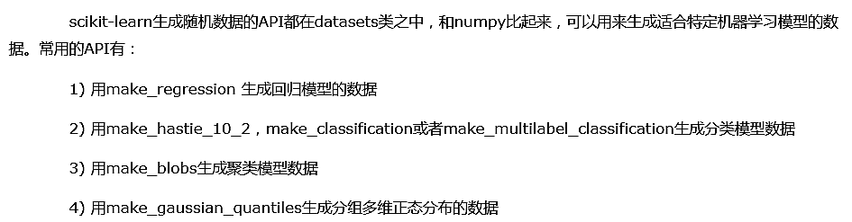
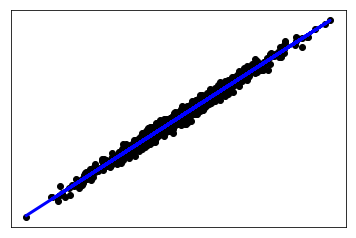
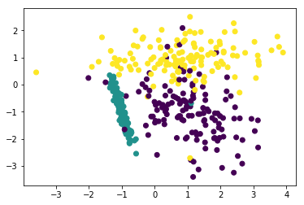
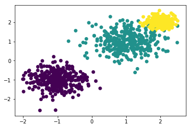
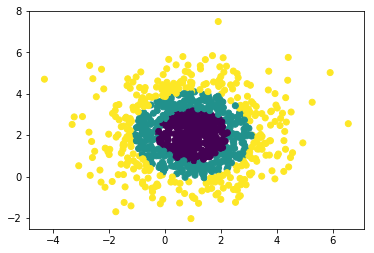

# 1. numpy随机数据生成API


```python
import numpy as np
```


```python
# rand(d0, d1, ..., dn) 用来生成d0xd1x...dn维的数组。数组的值在[0,1]之间
np.random.rand(3, 2)
```


    array([[ 0.7682837 ,  0.39011317],
           [ 0.52824475,  0.00780178],
           [ 0.08695836,  0.25887575]])


```python
# randn((d0, d1, ..., dn), 也是用来生成d0xd1x...dn维的数组。不过数组的值服从N(0,1)的标准正态分布
np.random.randn(3, 2)
```


    array([[-0.02649378, -1.06310746],
           [-1.49889971, -0.23917465],
           [-0.33309304,  0.10617311]])


```python
# randint(low[, high, size])，生成随机的大小为size的数据，size可以为整数，为矩阵维数，或者张量的维数。值位于半开区间 [low, high)
np.random.randint(3, size = [2, 3])
```


    array([[2, 0, 2],
           [1, 2, 2]])


```python
np.random.randint(3, 6, size = [2, 3])
```


    array([[3, 4, 4],
           [3, 3, 3]])


```python
# random_integers(low[, high, size]),和上面的randint类似，区别在与取值范围是闭区间[low, high]
np.random.random_integers(3, size = [2, 3])
```

    F:\Anaconda3\lib\site-packages\ipykernel\__main__.py:2: DeprecationWarning: This function is deprecated. Please call randint(1, 3 + 1) instead
      from ipykernel import kernelapp as app
    


    array([[3, 3, 1],
           [1, 2, 3]])


```python
# random_sample([size]), 返回随机的浮点数，在半开区间 [0.0, 1.0)。如果是其他区间[a,b),可以加以转换(b - a) * random_sample([size]) + a
np.random.random_sample([2, 3])
```


    array([[ 0.68564037,  0.73479468,  0.70792799],
           [ 0.2893952 ,  0.15527611,  0.54567664]])


# 2. scikit-learn随机数据生成API介绍



# 3. scikit-learn随机数据生成实例

## 3.1 回归模型随机数据


```python
# n_samples（生成样本数）， n_features（样本特征数），noise（样本随机噪音）和coef（是否返回回归系数）
import numpy as np
import matplotlib.pyplot as plt
%matplotlib inline
from sklearn.datasets.samples_generator import make_regression
```


```python
X, y, coef = make_regression(n_samples = 1000, n_features = 1, noise = 10, coef = True)
plt.scatter(X, y, color = 'black')
plt.plot(X, X * coef, color = 'blue', linewidth = 3)

# xticks和yticks: 为x,y轴的主刻度和次刻度设置颜色、大小、方向，以及标签大小
plt.xticks(())
plt.yticks(())
plt.show()
```





## 3.2 分类模型随机数据


```python
# n_samples（生成样本数）， n_features（样本特征数）， n_redundant（冗余特征数）和n_classes（输出的类别数）
import numpy as np
import matplotlib.pyplot as plt
%matplotlib inline
from sklearn.datasets.samples_generator import make_classification
# X1为样本特征，Y1为样本类别输出， 共400个样本，每个样本2个特征，输出有3个类别，没有冗余特征，每个类别一个簇
X1, Y1 = make_classification(n_samples = 400, n_features = 2, n_redundant = 0, n_clusters_per_class = 1, n_classes = 3)
plt.scatter(X1[:, 0], X1[:, 1], marker='o', c = Y1)
plt.show()
```





## 3.3 聚类模型随机数据


```python
# n_samples（生成样本数）， n_features（样本特征数），centers(簇中心的个数或者自定义的簇中心)和cluster_std（簇数据方差，代表簇的聚合程度）
import numpy as np
import matplotlib.pyplot as plt
%matplotlib inline
from sklearn.datasets.samples_generator import make_blobs
# X为样本特征，Y为样本簇类别， 共1000个样本，每个样本2个特征，共3个簇，簇中心在[-1,-1], [1,1], [2,2]， 簇方差分别为[0.4, 0.5, 0.2]
X, y = make_blobs(n_samples = 1000, n_features = 2, centers = [[-1, -1], [1, 1], [2, 2]], cluster_std = [0.4, 0.5, 0.2])
plt.scatter(X[:, 0], X[:, 1], marker = 'o', c = y)
plt.show()
```





## 3.4 分组正态分布混合数据


```python
# n_samples（生成样本数）， n_features（正态分布的维数），mean（特征均值）， cov（样本协方差的系数）， n_classes（数据在正态分布中按分位数分配的组数）
import numpy as np
import matplotlib.pyplot as plt
%matplotlib inline
from sklearn.datasets import make_gaussian_quantiles
#生成2维正态分布，生成的数据按分位数分成3组，1000个样本,2个样本特征均值为1和2，协方差系数为2
X1, Y1 = make_gaussian_quantiles(n_samples = 1000, n_features = 2, n_classes = 3, mean = [1, 2],cov = 2)
plt.scatter(X1[:, 0], X1[:, 1], marker = 'o', c = Y1)
```


    <matplotlib.collections.PathCollection at 0x192348aac50>




