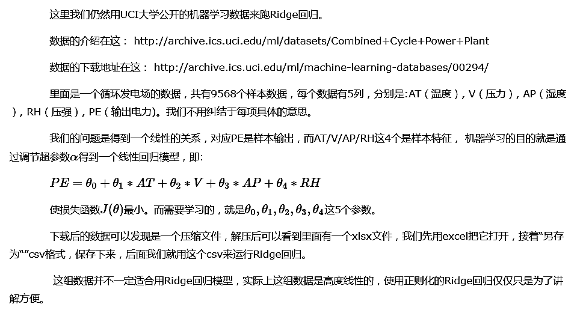

# 1. Ridge回归的损失函数


# 2. 数据获取与预处理



# 3. 数据读取与训练集测试集划分


```python
import matplotlib.pyplot as plt
%matplotlib inline
import numpy as np
import pandas as pd
from sklearn import datasets, linear_model

data = pd.read_csv('ccpp.csv')
X = data[['AT', 'V', 'AP', 'RH']]
y = data[['PE']]
```


```python
from sklearn.cross_validation import train_test_split

X_train, X_test, y_train, y_test = train_test_split(X, y, random_state=1)
```

# 4. 用scikit-learn运行Ridge回归


```python
from sklearn.linear_model import Ridge

# 要运行Ridge回归，我们必须要指定超参数α
ridge = Ridge(alpha = 1)
ridge.fit(X_train, y_train)

print(ridge.coef_)
print(ridge.intercept_)
```

    [[-1.97373209 -0.2323016   0.06935852 -0.15806479]]
    [ 447.05552892]
    


# 5. 用scikit-learn选择Ridge回归超参数α


```python
# 这里我们假设我们想在这10个α值中选择一个最优的值
from sklearn.linear_model import RidgeCV

ridgecv = RidgeCV(alphas = [0.01, 0.1, 0.5, 1, 3, 5, 7, 10, 20, 100])
ridgecv.fit(X_train, y_train)
ridgecv.alpha_
```


    7.0


输出结果为：7.0，说明在我们给定的这组超参数中， 7是最优的α值

# 6. 用scikit-learn研究超参数α和回归系数θ的关系


```python
# 通过Ridge回归的损失函数表达式可以看到，α越大，那么正则项惩罚的就越厉害，得到回归系数α就越小，最终趋近与0
# 而如果α越小，即正则化项越小，那么回归系数α就越来越接近于普通的线性回归系数

# X is a 10x10 matrix
X = 1. / (np.arange(1, 11) + np.arange(0, 10)[:, np.newaxis])
# y is a 10 x 1 vector
y = np.ones(10)
```


```python
n_alphas = 200
# alphas count is 200, 都在10的-10次方和10的-2次方之间
alphas = np.logspace(-10, -2, n_alphas)
```


```python
clf = linear_model.Ridge(fit_intercept=False)
coefs = []
# 循环200次
for a in alphas:
    # 设置本次循环的超参数
    clf.set_params(alpha = a)
    # 针对每个alpha做ridge回归
    clf.fit(X, y)
    # 把每一个超参数alpha对应的theta存下来
    coefs.append(clf.coef_)
```


```python
fig = plt.figure()
ax = fig.add_subplot(111)
ax.plot(alphas, coefs)
# 将alpha的值取对数便于画图
ax.set_xscale('log')
# 翻转x轴的大小方向，让alpha从大到小显示
ax.set_xlim(ax.get_xlim()[::-1]) 
plt.xlabel('alpha')
plt.ylabel('weights')
plt.title('Ridge coefficients as a function of the regularization')
# 使坐标系的最大值和最小值和你的数据范围一致
plt.axis('tight')
plt.show()
```


```python
np.arange(1, 11).shape
```


    (10,)


```python
np.arange(0, 10)[:, np.newaxis].shape
```


    (10, 1)


```python
np.arange(1, 11) + np.arange(0, 10)[:, np.newaxis]
```


    array([[ 1,  2,  3,  4,  5,  6,  7,  8,  9, 10],
           [ 2,  3,  4,  5,  6,  7,  8,  9, 10, 11],
           [ 3,  4,  5,  6,  7,  8,  9, 10, 11, 12],
           [ 4,  5,  6,  7,  8,  9, 10, 11, 12, 13],
           [ 5,  6,  7,  8,  9, 10, 11, 12, 13, 14],
           [ 6,  7,  8,  9, 10, 11, 12, 13, 14, 15],
           [ 7,  8,  9, 10, 11, 12, 13, 14, 15, 16],
           [ 8,  9, 10, 11, 12, 13, 14, 15, 16, 17],
           [ 9, 10, 11, 12, 13, 14, 15, 16, 17, 18],
           [10, 11, 12, 13, 14, 15, 16, 17, 18, 19]])


