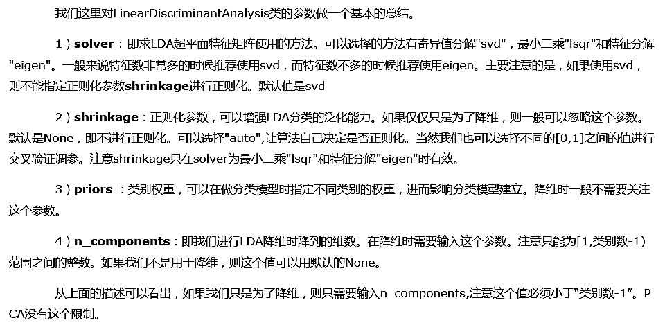

# 1. 对scikit-learn中LDA类概述


# 2. LinearDiscriminantAnalysis类概述



# 3. LinearDiscriminantAnalysis降维实例


```python
# 在LDA的原理篇我们讲到，PCA和LDA都可以用于降维。两者没有绝对的优劣之分，使用两者的原则实际取决于数据的分布。
# 由于LDA可以利用类别信息，因此某些时候比完全无监督的PCA会更好。下面我们举一个LDA降维可能更优的例子。
# 我们首先生成三类三维特征的数据，代码如下：
import numpy as np
import matplotlib.pyplot as plt
from mpl_toolkits.mplot3d import Axes3D
%matplotlib inline
from sklearn.datasets.samples_generator import make_classification

# n_informative 信息特征
X, y = make_classification(n_samples=1000, n_features=3, n_redundant=0, n_classes=3, n_informative=2,
                          n_clusters_per_class=1, class_sep=0.5, random_state=10)
fig = plt.figure()
ax = Axes3D(fig, rect=[0, 0, 1, 1], elev=30, azim=20)
plt.scatter(X[:, 0], X[:, 1], X[:, 2], marker='o', c=y, edgecolors='black')
```

    F:\Anaconda3\lib\site-packages\matplotlib\collections.py:865: RuntimeWarning: invalid value encountered in sqrt
      scale = np.sqrt(self._sizes) * dpi / 72.0 * self._factor
    


    <mpl_toolkits.mplot3d.art3d.Path3DCollection at 0x20b2aef2908>


```python
# 先我们看看使用PCA降维到二维的情况，注意PCA无法使用类别信息来降维，代码如下：
from sklearn.decomposition import PCA
pca = PCA(n_components=2)
pca.fit(X)
print(pca.explained_variance_ratio_)
print(pca.explained_variance_)
X_new = pca.transform(X)
plt.scatter(X_new[:, 0], X_new[:, 1], marker='o', c=y, edgecolors='black')
```

    [ 0.43377069  0.3716351 ]
    [ 1.20962365  1.03635081]
    


    <matplotlib.collections.PathCollection at 0x20b2b3dddd8>


```python
# 由于PCA没有利用类别信息，我们可以看到降维后，样本特征和类别的信息关联几乎完全丢失。
# 现在我们再看看使用LDA的效果，代码如下：
from sklearn.discriminant_analysis import LinearDiscriminantAnalysis
lda = LinearDiscriminantAnalysis(n_components=2)
lda.fit(X, y)
X_new = lda.transform(X)
plt.scatter(X_new[:, 0], X_new[:, 1], marker='o', c=y, edgecolors='black')
```


    <matplotlib.collections.PathCollection at 0x20b2b58c6d8>


```python
# 可以看出降维后样本特征和类别信息之间的关系得以保留。
# 一般来说，如果我们的数据是有类别标签的，那么优先选择LDA去尝试降维；
# 当然也可以使用PCA做很小幅度的降维去消去噪声，然后再使用LDA降维。如果没有类别标签，那么肯定PCA是最先考虑的一个选择了。
```
